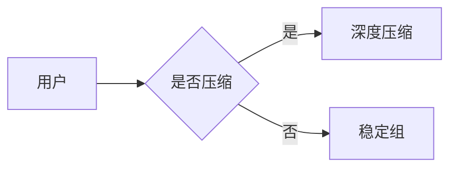

# Velora Round-Trip 测试样例

覆盖 MVP 全部元素类型。序列化策略:**语义无损 + 风格归一**(ATX 标题、`-` 列表、两空格缩进)。

## 文本与行内

这是一段 **粗体**、*斜体*、~~删除线~~ 和 `行内代码` 的混合。

这里有[一个链接](https://velora.dev) 和一张普通图片:


## 列表

- 一级 A
  - 二级 A1
  - 二级 A2
- 一级 B

1. 第一
2. 第二

- [x] 已完成任务
- [ ] 未完成任务

## 引用与分隔

> 引用一段文字
> 多行引用

---

## 代码

```ts
interface Doc {
  id: string;
  blocks: Block[];
}
```

## 表格

| 特性 | Typora | Velora |
| --- | --- | --- |
| Mermaid | 支持 | 极致 |
| SVG | HTML 嵌入 | 一级节点 |

## Mermaid



## SVG(文件引用)


## SVG(内联)

<svg viewBox="0 0 100 40" xmlns="http://www.w3.org/2000/svg">
  <rect width="100" height="40" fill="#eef2ff"/>
  <text x="10" y="24" font-size="14">Velora</text>
</svg>

## 数学

行内公式 $E = mc^2$ 和块级公式:

$$
\int_0^1 x^2 \, dx = \frac{1}{3}
$$
